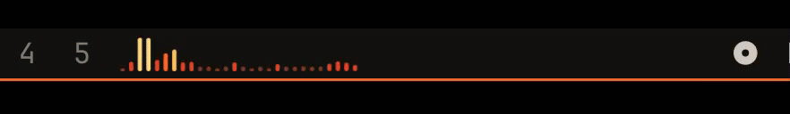

# Ember — Audio Controller and Visualiser

A living, theme-aware [Cava](https://github.com/karlstav/cava) spectrum for the Omarchy bar, paired with a compact MPRIS now-playing control and optional ember effects.

Hover it to reveal the current title and play/pause control. The metadata scrolls when needed; click it once to play/pause, twice to skip forward, and three times to go back. Clicking the spectrum focuses the active media source when it supports MPRIS `Raise`.



## Requirements

- Omarchy with the Quickshell bar
- Cava with PipeWire support. If it is not installed, Ember shows a small
  flowing setup wave in the bar; click it to copy the command or open it in a
  terminal, where it remains visible and uses the normal package confirmation:

  ```bash
  omarchy pkg add cava
  ```

Players need to expose MPRIS metadata and controls. Spotify and browser media such as YouTube and Netflix work when their MPRIS integration is available.

## Install

```bash
omarchy plugin add https://github.com/JoshZ7/omarchy-afterglow.git --enable
```

The widget is placed in the left bar section by default. Move it with Omarchy's bar editor or CLI if you prefer another position.

## Controls

- Hover: reveal media controls and scrolling metadata.
- Click title or play/pause: toggle playback.
- Double-click title: next track.
- Triple-click title: previous track.
- Click spectrum: raise the active player, or open the Cava fallback.

## Settings

Add settings to the widget entry in `~/.config/omarchy/shell.json`:

```json
{
  "id": "io.github.joshz7.afterglow",
  "showNextButton": false,
  "showPlayPauseButton": true,
  "doubleClickSkips": true,
  "hoverFeedback": true,
  "collapsedWidth": 178,
  "expandedWidth": 348,
  "spectrumBars": 28,
  "sparkIntensity": "normal",
  "colorMode": "theme"
}
```

`sparkIntensity` accepts `off`, `soft`, `normal`, or `full`. The right-click settings menu provides these controls, along with a visualiser-width slider that changes the number of displayed frequency bands.

`colorMode` accepts `theme` (the default) or `bonfire`. Bonfire uses a fixed ember, red, orange, gold, and yellow ramp regardless of the active desktop theme.

Theme authors can override hover feedback in a theme's `colors.toml`:

```toml
cava_hover = "#8BE9FD"
```

Use `cava_hover = "none"` to disable hover colour feedback for that theme only. Themes may also supply `cava_1` through `cava_5` to control the spectrum colour ramp.

## Uninstall

```bash
omarchy plugin remove io.github.joshz7.afterglow
```

## License

MIT. See [LICENSE](LICENSE).
